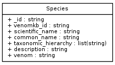
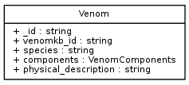
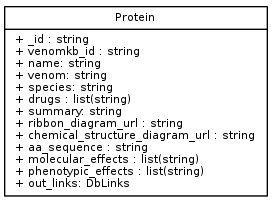
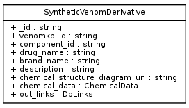

# VenomKB data model/schema

_author: Joseph D. Romano_
_last updated: 02-25-2017_

This document explains the structure of the documents present in VenomKB.

For technical information regarding the configuration of the MongoDB server itself, please refer to [db_server.md](./db_server.md).

- - -

## Background

VenomKB was originally published (v1.0) as a set of three SQL database tables, named `manual_venoms`, `vextractor_results`, and `semantic_vextractor_results`.

For more details, see [history.md](./history.md).

- - -

## Database schema

VenomKB is an extension of [Venom Ontology](https://www.ncbi.nlm.nih.gov/pmc/articles/PMC5001765/), and the database schema was designed to match. The primary entity types (e.g., "documents") in VenomKB correspond to the major leaf-node classes in Venom Ontology, and are named:

- Species
- Venom
- Synthetic venom derivative
- Protein

Below we walk through the components of each of these data types:

- - -

#### Species
Each species in VenomKB has at least one venom-derived peptide/protein also in VenomKB.

#### Venom
Every venomous species in VenomKB is inferred to have a 'venom', which is a collection of venomous components. For the purposes of VenomKB, these are primarily proteins.

#### Protein
Proteins are biological macromolecules that consist of one or more chains of amino acids, often with numerous chemical modifications. Proteins serve many purposes in living organisms. One of the major classes of proteins - enzymes, which catalyze reactions - is responsible for most of the interesting properties exhibited by venoms. Therefore, proteins make up the class of venom components that is of most interest to drug discovery.

#### Synthetic venom derivative
A synthetic venom derivative is any man-made chemical compound that is based on the structure of a molecule isolated from a venom. These are usually polypeptides, and are usually employed for therapeutic purposes. 

Synthetic venom derivatives are distinctly different from their naturally occurring counterparts in that they are highly optimized for pharmaceutical or industrial uses, and are often modified specifically to mitigate their harmful effects in humans. One of the main goals of VenomKB and its related studies is to characterize the differences between venom peptides and their synthetic forms, and apply those discoveries to venoms that have not yet been turned into therapeutic compounds meant for human use.

Note that this does not include antivenoms, which are neither synthetic nor are they of interest within the scope of VenomKB.

- - -
## Class Diagram

Below are the classes described above, linked together in a structure compliant with Venom Ontology.
